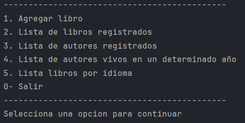

# Liter Alura.
Practicando Spring Boot: Challenge Literalura

## Sobre el challenge.🚀
_Desarrollar un Catálogo de Libros que ofrezca interacción textual (vía consola) con los usuarios, proporcionando al menos 5 opciones de interacción. Los libros se buscarán a través de una API específica._
_Los pasos para completar este desafío son:_
* _Configuración del Ambiente Java;_
* _Creación del Proyecto;_
* _Consumo de la API;_
* _Análisis de la Respuesta JSON;_
* _Inserción y consulta en la base de datos;_
* _Exibición de resultados a los usuarios;_

### Pre-requisitos 📋
* _Maven: versión 4 en adelante_
* _Spring: versión 3.2.3_
* _Postgres: versión 16 en adelante_

Dependencias:
* Spring Data JPA
* Postgres Driver

### Galeria 📌
_Mensaje de bienvenida y menu principal._

## Construido con 🛠️
* [Java JDK](https://www.oracle.com/br/java/technologies/downloads/) - Java JDK: versión 17

## Autores ✒️
* **Ricardo Zamora Picazo** - [Ricardo ZP](https://github.com/pzric)
