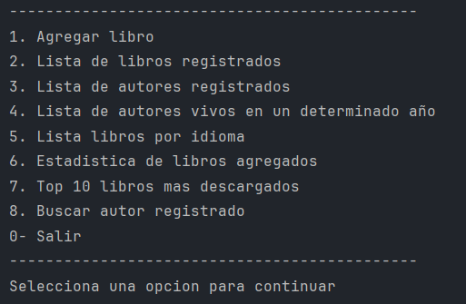
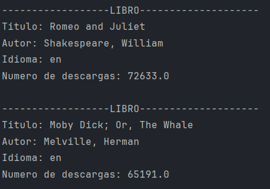
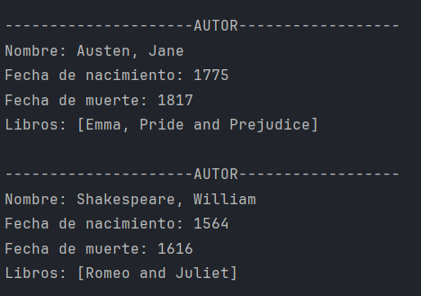

# Liter Alura - Practicando Spring Boot: Challenge Literalura

En este desafio, desarrollaremos un Catálogo de Libros que permite interactuar con los usuarios a través de la consola, utilizando Spring Boot y accediendo a una API específica para obtener datos de libros.

## Objetivos del Proyecto

Los objetivos principales de este desafío incluyen:

- Consumir una API externa para obtener datos de libros.
- Utilizar una base de datos relacional para el almacenamiento persistente de datos.
- Proporcionar una interfaz de consola para interactuar con los usuarios y mostrar resultados.

## Funcionalidades

El proyecto deberá ofrecer al menos las siguientes funcionalidades:

- Búsqueda de libros por título.
- Listado de todos los libros.
- Búsqueda de libros por autor.
- Mostrar detalles de un libro específico.
- Opcional: Funcionalidades avanzadas como estadísticas de libros más descargados y búsqueda de autores por nombre.

## Prerrequisitos

Asegúrate de tener las siguientes herramientas y dependencias instaladas:

- Maven 4+
- Spring 3.2.3+
- PostgreSQL 16+
- Spring Data JPA
- Lombok
- Spring Boot DevTools
- PostgreSQL Driver


## Galería

Aquí tienes un vistazo de Liter Alura:





## Empezando

Sigue estos pasos para configurar y ejecutar el proyecto:

1. **Clona el repositorio:**

   ```bash
   git clone https://github.com/pzric/Liter-alura.git
   cd Liter-alura

2. **Configura la base de datos:**
   - Asegúrate de tener PostgreSQL instalado y configurado localmente.
   - Crea una base de datos llamada `liter-alura` en tu servidor PostgreSQL.

3. **Actualiza la configuración:**

   - Abre el archivo `application.properties` en `src/main/resources`.
   - Configura las propiedades de conexión a tu base de datos:
   ```bash
   spring.datasource.url=jdbc:postgresql://localhost:5432/liter-alura
   spring.datasource.username=tu_usuario
   spring.datasource.password=tu_contraseña
   spring.jpa.hibernate.ddl-auto=update
   spring.jpa.show-sql=true

4. **Compila y ejecuta el proyecto:**
   ```bash
   mvn spring-boot:run
   
5. **Interactúa con la aplicación:**

Utiliza la consola para interactuar con las funcionalidades implementadas.

## Licencia
Este proyecto está licenciado bajo la Licencia MIT.

## Author ✒️

* **Ricardo Zamora Picazo** - [Ricardo ZP](https://github.com/pzric)